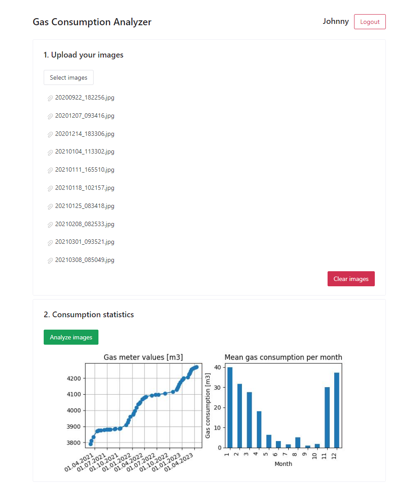

# Gas Consumption Analyzer
A solution for the [gas consumption assignment](assets/assignment.pdf).

Attila Zsíros, 2024
 
## Dashboard screenshot

## Run it on your own
 1. Run `docker-compose up`.
 2. Open your browser at `localhost` or `127.0.0.1`.
 3. Register as a new user.
 4. Select your dataset images to upload (min 80) and wait until they are uploaded.
 5. Click the `Analyze images` button and wait until they are analyzed (for 80 images it takes around 4 minutes).
 6. Examine the plotted figure.

## Hosting
The application could be published to the internet by hosting it locally and connecting it to Cloudflare using the [Cloudflare Tunnel](https://developers.cloudflare.com/cloudflare-one/connections/connect-networks/). This is an easier and more secure way than exposing our IP address to the internet by port forwarding.

## Notes and future improvements
 - The individual steps in the digit extraction algorithm can be examined using the `demo.py` script. Just set the correct path to your dataset folder.
   - It uses mainly mathematical morphology techniques for preprocessing and [pytesseract](https://pypi.org/project/pytesseract/) for OCR.
 - Since the digit extraction algorithm is not perfect, it may produce incorrect values. Thus, when plotting the consumption, the application does outlier filtering based on 20 neighbors using the [LocalOutlierFactor](https://scikit-learn.org/stable/modules/generated/sklearn.neighbors.LocalOutlierFactor.html) algorithm.
   - The parameters for this algorithm were chosen to work properly with the provided dataset.
   - As a future improvement, the user could be given control inputs for setting these outlier filtering parameters.